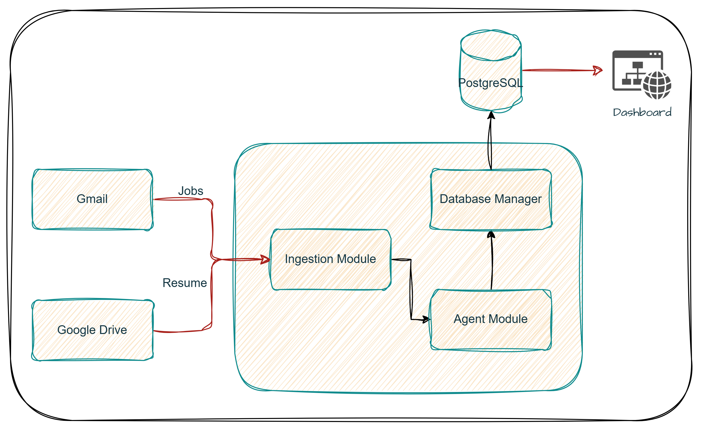
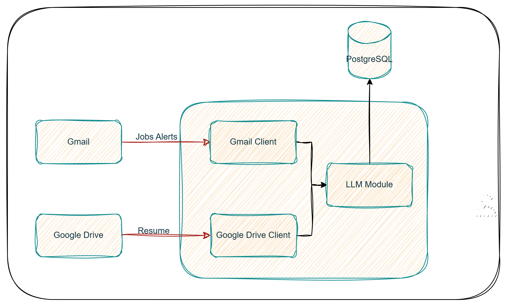
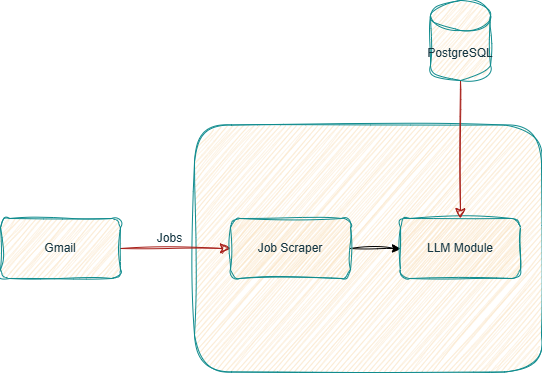

# JOB BUDDY

### Technical Stack

- Language: Python 3.11+
- AI Model: Google Gemini 2.5 Flash
- Database: PostgreSQL
- APIs: Google Gmail API v1, Google Drive API v3
- Frontend: Streamlit
- Libraries: ```google-api-python-client, psycopg2-binary, python-dotenv PyPDF2```

## Phase 3: 

Good news! Buddy is promoted to Manager now... He has made my life so much easier. He aggregrates all my jobs in one dashboard and he even organizes my Inbox!

### Architecture



#### Features
- Inbox Automation: categorizes job alerts in Gmail with custom labels (High-Match, Processed) and archives them.
- Interactive Dashboard: A Streamlit-based UI to browse matches, view the job is a strong match and ready to apply
- Automated Workflow: Dashboard allows you to start the agent with a single click.

## Phase 2: Intelligent Job Scoring

In the Phase 2, Buddy is smarter! He is no longer an assistant but Analyst. He retrieves my resume from google drive and then looks at the job alert emails and scores the jobs and gives me insights!

### Architecture



#### Features
- Dyanmic Context Injection: the latest resume is pulled from Google Drive and injected into prompt
- Intelligent Scoring: Jobs are graded based on alignment with the Resume
- Automated Reasoning: Every scores includes a 'reason' to provide transparency

## Phase 1: Data Ingestion and Extraction

In the Phase 1, Buddy is my personal assistant; my faithful buddy who stands with me during this arduous journey
- retrieve all the pilled up job alerts emails in my inbox
- extracts all the important info I need from these emails
- store it in my database for ranking and tracking.

### Architecture




#### Features

- HTML Sanitization: regex-based custom clearning to reduce the email payload size by 80%
- Deduplication: uses gmail_id to handle duplicate alerts
- Context Safety: managed LLM context windows by added character limits
- Batch Processing: Retrieves 10-30 batches of emails, resulting in extraction of dozens of job opportunities in seconds

# Installation and Set up

### 1. Clone the respository
```
git clone https://github.com/your-username/the_buddy_project.git
cd job_buddy
```
### 2. Install dependencies
```
pip install -r requirements.txt
```
### 3. Run the dashboard
```
streamlit run app.py
```